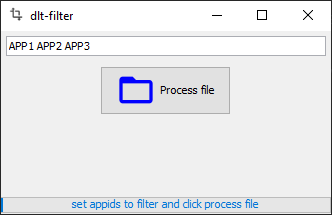

# dlt-tools

This repository aims to be a central repository for different tools to work with dlt-files. 

DLT (Diagnostic Log and Trace) is an AUTOSAR standardized format for automotive logging and tracing.  

Currently only dlt v1 is supported.

## tools

### dlt-filter

dlt-filter is a gui application to preprocess dlt files by filtering out only the specified app-ids.

You'll provide a list of app-ids, then you can open a file and write a filtered file out.

Screenshot:  

